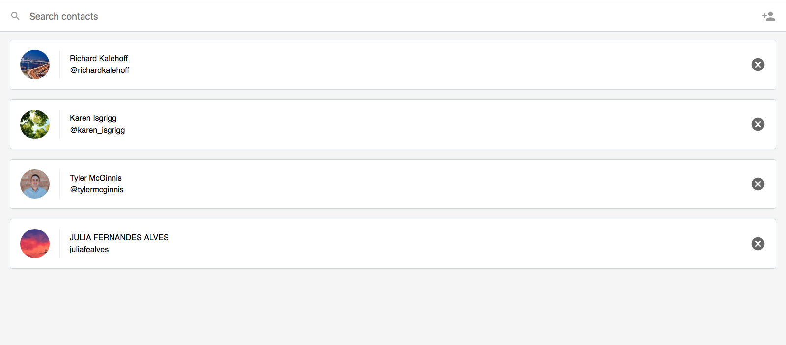
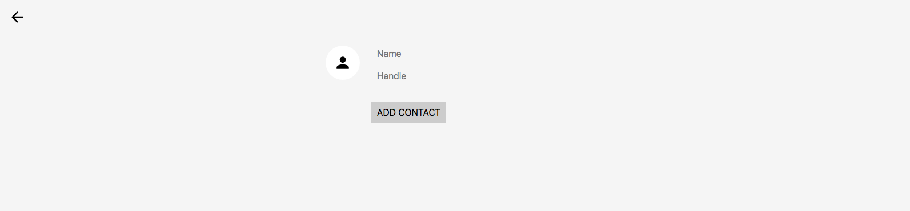

# :bird: Twitter Contacts
> Development of a small application for managing Twitter contacts. Based on the fundamentals in React from Udacity.

## Screens

> List all contacts.

> Create a new contact.

## Resources used:

- [React Router](https://reacttraining.com/react-router/)
- [PropTypes](https://www.npmjs.com/package/prop-types)
- [form-serialize](https://www.npmjs.com/package/form-serialize)
- [create-react-app](https://facebook.github.io/create-react-app/)
- [Contact API](https://github.com/udacity/reactnd-contacts-server2)
